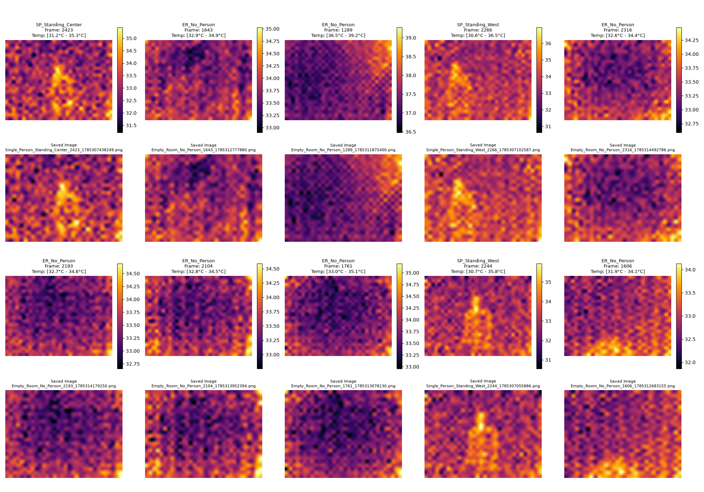
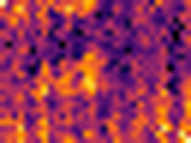
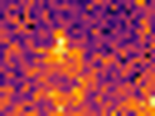
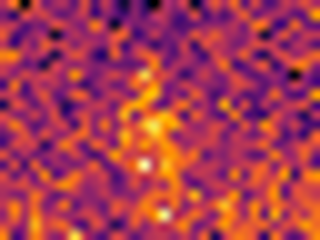
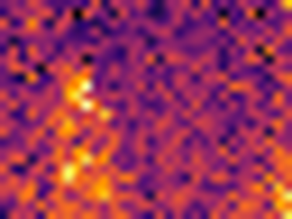
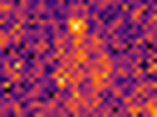
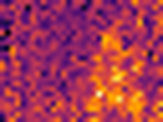
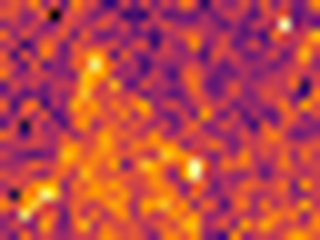
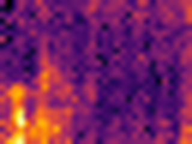
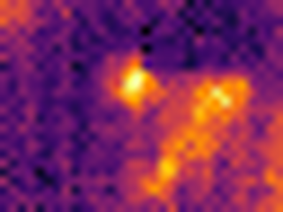

# MLX90640 Thermal IR Dataset

**Joint human presence, posture, and bounding-box labels on native 32×24 thermal frames**

Indoor recordings from a Melexis **MLX90640** far-infrared array (768 temperature samples, \(55^\circ \times 35^\circ\) field of view). Each frame is labelled for occupancy and posture on the **left and right halves** of the field of view, plus a **bounding box** when a person is in view.

This is the corpus used in:

> S. M. Haa-mim, M. R. Uddin, A. Rouf, A. Yasin, and R. Hasan, *A Dual-Head Convolutional Network for Joint Human Presence, Posture and Bounding-Box Estimation from Ultra-Low-Resolution Thermal Images*, SoCTA 2026 (LNNS, Springer).

If you use this dataset, please cite that paper (see [Citation](#citation)).

<p align="center">
  
</p>

<p align="center"><sub>Figure 1. Native 32×24 frames rendered as heatmaps. Occupied frames show a compact warm region; empty-room frames do not.</sub></p>

---

## Why this dataset exists

RGB video is a poor fit for homes and care settings: it identifies people. Wearables only work if they are worn. Binary PIR sensors report motion and little else.

A 32×24 thermal grid sits in between. A body is visible without illumination, and at 768 pixels there is no usable face. What the literature usually does **not** provide at this resolution is all three of:

1. is anyone there,
2. are they standing, sitting, or lying,
3. where in the field of view they are.

This release does.

---

## At a glance

| | |
|---|---|
| Sensor | MLX90640, 32×24, temperatures in °C |
| Field of view | \(55^\circ \times 35^\circ\) |
| Frames | **3108** (1533 empty, 1575 occupied scenarios) |
| Scenarios | 9 folders (see below) |
| Occupants | one person at a time, or none |
| Classification | 8 binary labels per frame (presence + 3 postures × 2 halves) |
| Localisation | axis-aligned box \([x_1, y_1, x_2, y_2]\) on a 10× upscaled canvas |
| Visualisation | PNG heatmap per frame |
| Known defect | pixel index 557 is a dead pixel (`NaN` in every frame) |

---

## One frame from each scenario

Nine folders, nine examples. Dark / purple is cooler background; yellow is the occupant.

<table>
  <tr>
    <td align="center" width="33%"><br/><b>Empty room</b><br/>1533 frames</td>
    <td align="center" width="33%"><br/><b>Standing, centre</b><br/>93 frames</td>
    <td align="center" width="33%"><br/><b>Standing, east</b><br/>210 frames</td>
  </tr>
  <tr>
    <td align="center"><br/><b>Standing, west</b><br/>231 frames</td>
    <td align="center"><br/><b>Sitting, centre</b><br/>111 frames</td>
    <td align="center"><br/><b>Sitting, east</b><br/>215 frames</td>
  </tr>
  <tr>
    <td align="center"><br/><b>Sitting, west</b><br/>181 frames</td>
    <td align="center"><br/><b>Lying, east</b><br/>310 frames</td>
    <td align="center"><br/><b>Lying, west</b><br/>224 frames</td>
  </tr>
</table>

Lying was recorded east and west only (no centre). Standing and sitting were recorded at centre, east, and west.

---

## Folder layout

```
dataset-IR/
├── README.md
├── preview/                          # images used in this README
├── Empty_Room_No_Person/
│   ├── Empty_Room_No_Person.joblib   # list of {frame_number, timestamp, pixels}
│   ├── Empty_Room_No_Person.json     # labels keyed by frame id
│   ├── Empty_Room_No_Person_image/   # one PNG heatmap per frame
│   └── Empty_Room_No_Person_video/
├── Single_Person_Standing_Center/
│   ├── Single_Person_Standing_Center.joblib
│   ├── Single_Person_Standing_Center.json
│   ├── Single_Person_Standing_Center_image/
│   ├── Single_Person_Standing_Center_video/
│   └── pixlab_*_bounding_box/        # PixLab export used to draw the box
└── … (same pattern for the other seven occupied folders)
```

Frame keys look like:

```
Single_Person_Standing_West_2104_1785306756357
```

that is `{folder}_{frame_number}_{timestamp_ms}`. The matching PNG uses the same stem.

### Counts

| Folder | Positions | Frames | Annotated boxes | Occupied halves |
|---|---:|---:|---:|---:|
| `Empty_Room_No_Person` | 1 | 1533 | 0 | 0 |
| `Single_Person_Standing_Center` | 1 | 93 | 92 | 184 |
| `Single_Person_Standing_East` | 1 | 210 | 207 | 251 |
| `Single_Person_Standing_West` | 1 | 231 | 230 | 288 |
| `Single_Person_Sitting_Center` | 1 | 111 | 108 | 212 |
| `Single_Person_Sitting_East` | 1 | 215 | 210 | 210 |
| `Single_Person_Sitting_West` | 1 | 181 | 169 | 197 |
| `Single_Person_Lying_East` | 1 | 310 | 304 | 433 |
| `Single_Person_Lying_West` | 1 | 224 | 213 | 417 |
| **Total** | **9** | **3108** | **1533** | **2192** |

Occupied halves can exceed boxed frames because a person near the midline is labelled in **both** halves. 42 occupied frames have no box (person leaving the field of view); those boxes are stored as `[0, 0, 0, 0]` and should be withheld from a localisation loss.

---

## Labels

Each JSON file is nested as `{folder_name: {frame_key: [left, right, box]}}`.

```json
"Single_Person_Standing_Center_2378_1785307342318": [
  [1, 1, 0, 0],
  [1, 1, 0, 0],
  [51, 29, 196, 240]
]
```

| Field | Meaning |
|---|---|
| Left `[c, st, si, ly]` | occupancy of the left half, then one-hot standing / sitting / lying |
| Right `[c, st, si, ly]` | same for the right half |
| Box `[x1, y1, x2, y2]` | top-left and bottom-right on the **320×240** canvas |

`c = 1` means a person is in that half. Posture bits are only meaningful when `c = 1`. Both halves can be 1 at once (centre occupant). Empty-room boxes are `[0, 0, 0, 0]`.

### Turning the box into \([0, 1]^4\)

Boxes were drawn in PixLab on frames upscaled 10× (`32×24 → 320×240`). To recover normalised coordinates used in training:

```
x1' = (x1 / 10) / 32
y1' = (y1 / 10) / 24
x2' = (x2 / 10) / 32
y2' = (y2 / 10) / 24
```

which is the same as dividing by 320 and 240.

---

## Thermal frames (`.joblib`)

Each joblib file is a Python `list` of dicts:

```python
{
  "frame_number": 2378,
  "timestamp": ...,
  "pixels": [t0, t1, ..., t767]   # °C, length 768 = 24 * 32
}
```

Reshape as **`(24, 32)`** (rows × columns), matching the training code.

### Recommended cleaning

1. Replace `NaN` (dead pixel 557, plus rare extras) with the column median, falling back to the global median (~33.4 °C).
2. Clip to `[20, 50]` °C. Raw dumps contain physically impossible spikes.
3. Standardise with **training-split** statistics. On the 80/10/10 split with seed 42 those were \(\mu = 33.4485\) °C, \(\sigma = 0.6860\) °C.

Suggested split: **2486 / 311 / 311**, stratified by folder, `random_state=42`.

---

## Minimal loader

```python
import json
import joblib
import numpy as np
from pathlib import Path

root = Path("dataset-IR")
folder = "Single_Person_Standing_West"
records = joblib.load(root / folder / f"{folder}.joblib")
labels = json.loads((root / folder / f"{folder}.json").read_text())[folder]

rec = records[0]
key = f"{folder}_{rec['frame_number']}_{int(rec['timestamp'] * 1000)}"  # if timestamps are seconds
# keys in JSON already match the PNG stem; safer to iterate JSON keys
key = next(iter(labels))
left, right, box = labels[key]
frame = np.asarray(rec["pixels"], dtype=np.float32).reshape(24, 32)

print(left, right, box, frame.shape, np.nanmin(frame), np.nanmax(frame))
```

If a key does not match, build it from the PNG filename stem instead of guessing the timestamp unit.

---

## What this dataset is not

- Not multi-occupant. Four box coordinates cannot describe two bodies.
- Not multi-room or multi-mount. One room, one sensor placement.
- Not a privacy proof. 768 pixels remove a recoverable face; they do not make the stream anonymous in a formal sense.

---

## Citation

```bibtex
@inproceedings{haamim2026mlx90640,
  author    = {Haa-mim, Saklaen Mohammad and Uddin, Md. Raihan and Rouf, Abdur and Yasin, Abbas and Hasan, Raqibul},
  title     = {A Dual-Head Convolutional Network for Joint Human Presence,
               Posture and Bounding-Box Estimation from Ultra-Low-Resolution
               Thermal Images},
  booktitle = {Soft Computing: Theories and Applications (SoCTA)},
  series    = {Lecture Notes in Networks and Systems},
  publisher = {Springer},
  year      = {2026},
  note      = {Dataset: https://github.com/abbasyasin1n2/mlx90640-thermal-ir-dataset}
}
```

Update the `note` URL to whatever repository name you actually create.

---

## Authors

Department of Computer Science and Engineering, Independent University, Bangladesh, Dhaka, Bangladesh

- Saklaen Mohammad Haa-mim  
- Md. Raihan Uddin  
- Abdur Rouf (corresponding: `abdur230rouf@gmail.com`)  
- Abbas Yasin  
- Raqibul Hasan  

---

## License

Released for academic use. If you republish or train on it, cite the paper above. For a formal licence on GitHub, CC BY 4.0 is a reasonable default (attribution required, commercial use allowed). Add a `LICENSE` file when you create the repository.

## Acknowledgements

Bounding boxes were annotated in PixLab on 10× upscaled heatmaps. The architecture figure in the paper was generated with the Gemini image generator for schematic illustration; the data and labels were not.
